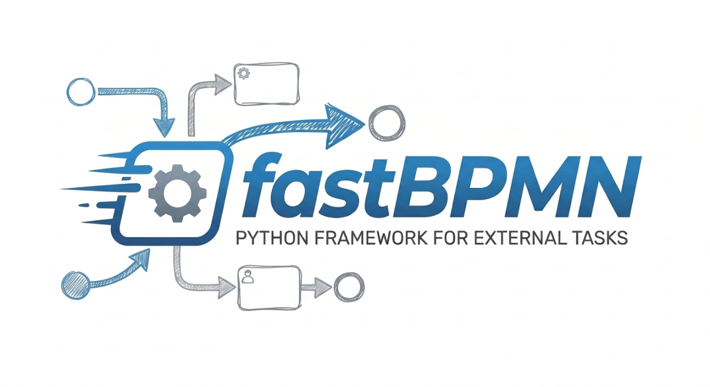

# Get started

## Prerequisites

* [ ] a camunda7 compatible process engine (squirrel currently supports camunda7 and derivatives only)
  (look at [int](integrations))
* [ ] a process full of external tasks / service tasks you want to process
* [ ] a few minutes to setup your python project

## Installation

```shell
# add fastbpmn as dependency to your project
uv add fastbpmn
```

## Example

The example refers to the examples provided for each of the supported process engines (see [integrations](./integrations/index.md))

``` python title="example.py"
from contextlib import asynccontextmanager

import structlog

import squirrel
from fastbpmn import FastBPMN
from fastbpmn.models import BaseOutputModel


logger = structlog.get_logger(__name__)

@asynccontextmanager
async def lifespan(app):
    logger.info("init your resources here")
    yield
    logger.info("ensure to properly close them here")


minion = FastBPMN(
    name="Bob",
    lifespan=lifespan
)

class Greeting(BaseOutputModel):
    greeting: str


@minion.external_task(
    topic="build-greeting",
    output_class=Greeting,
)
def build_greeting():
    return Greeting(greeting="Hello from FastBPMN")

@minion.external_task(
    topic="build-greeting",
    input_class=Greeting,
)
def shoutout(value: Greeting):
    logger.info(f"shoutout: {value.greeting}")


if __name__ == '__main__':
    from structlog_config import configure_logger
    log = configure_logger()

    #structlog.stdlib.recreate_defaults(log_level=logging.INFO)

    squirrel.run(
        minion,
        flavour="camunda7",
        name="bob",
        workers=10,
        camunda_url=os.getenv("engine_url"),
        camunda_username=os.getenv("engine_username"),
        camunda_password=os.getenv("engine_password"),
    )
```

## Start

```shell
engine_url=<your url> uv run example.py
```
